# LatihanVCS
## Cara install Git di Windows
### 1. Unduh Git
untuk menginstall Git, anda perlu mengunduh file-nya terlebih dahulu di situs resminya. karena saya pakai git-scm, linknya adalah https://git-scm.com/
### 2. Install Git
- setelah selesai mengunduh file Git, silahkan install aplikasi nya, caranya seperti dibawah ini
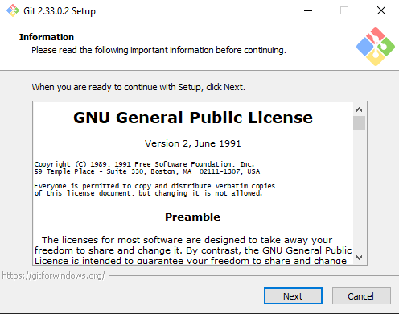
- lalu klik next terus seperti gambar dibawah, sampai ke menu install
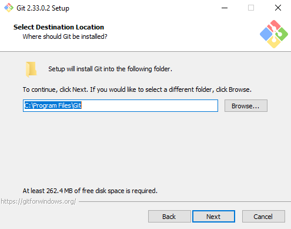
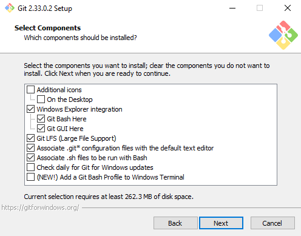
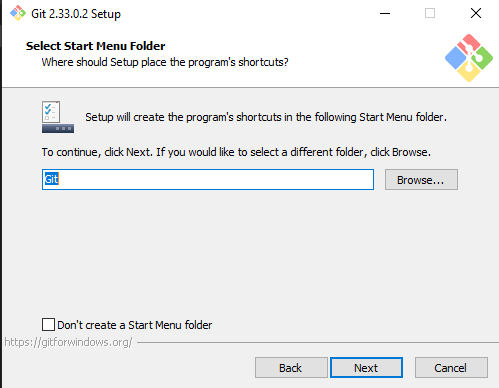
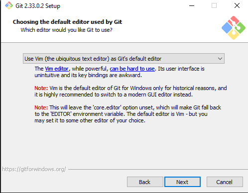
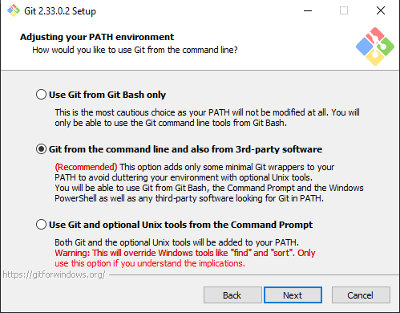
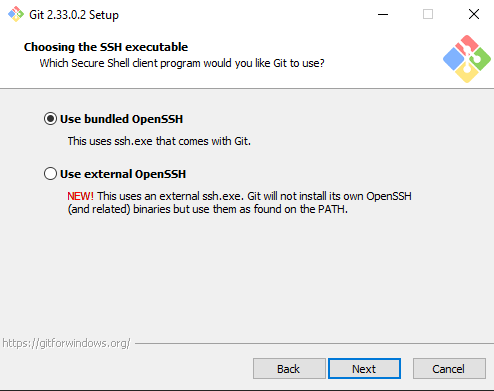
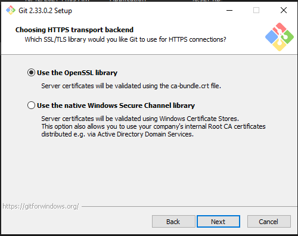
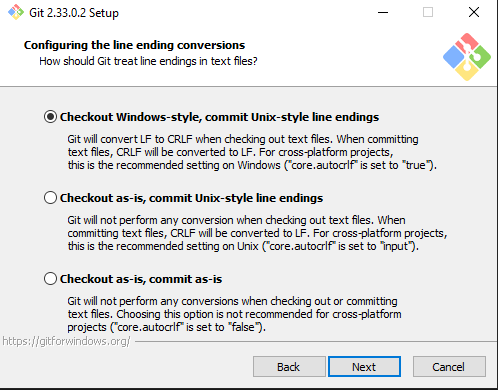
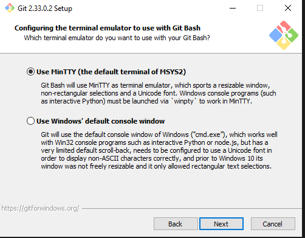
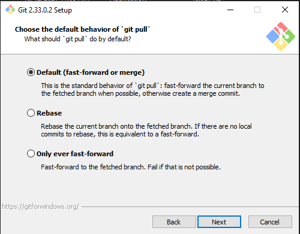
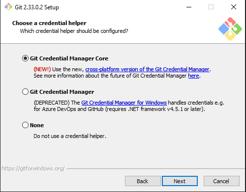
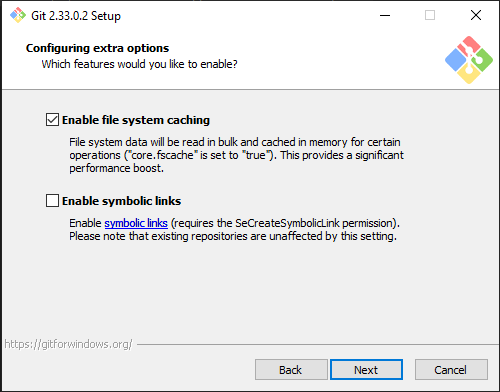
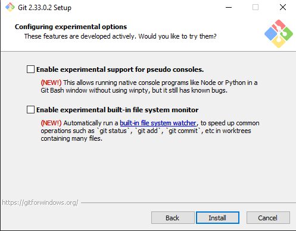
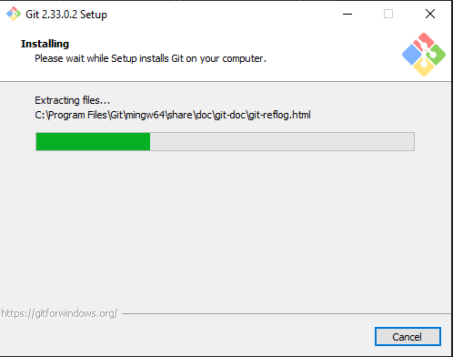
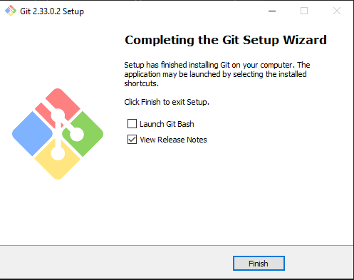
