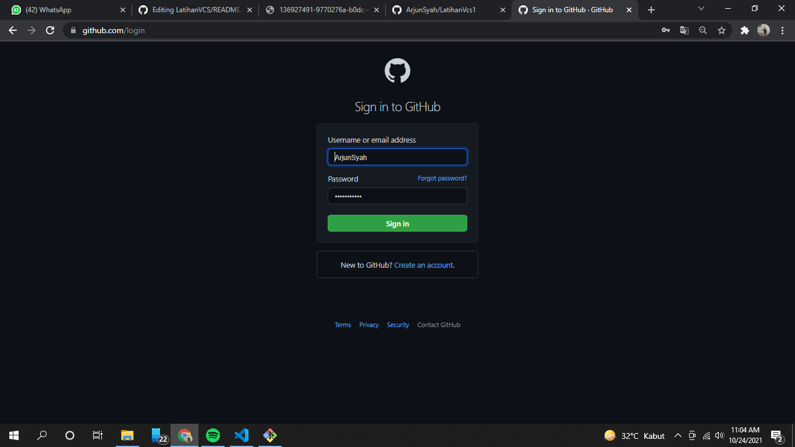
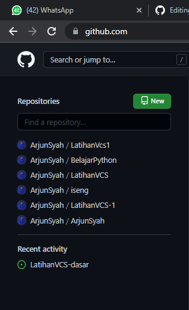
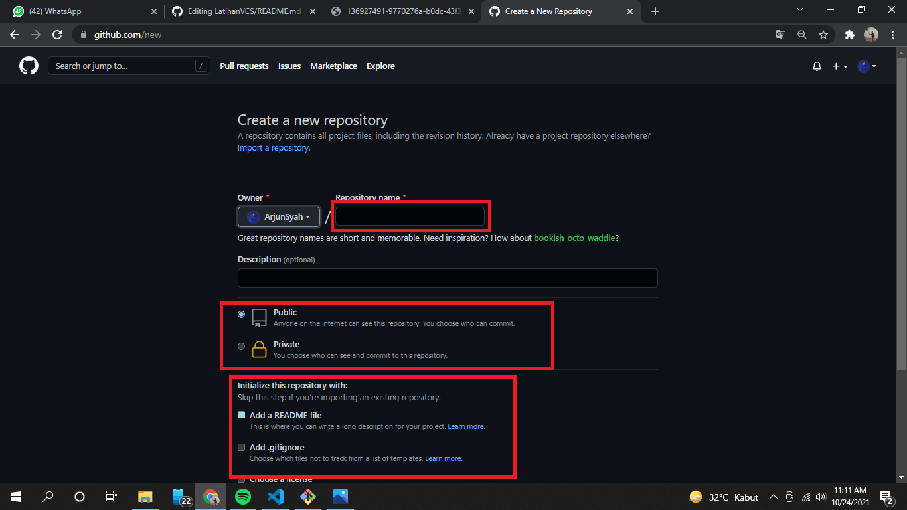

# LatihanVCS
# Tutorial instal,membuat akun,cara penggunaan git dan git hub
## Cara install git di winddows
### 1. Unduh Git
untuk menginstall Git, anda perlu mengunduh file-nya terlebih dahulu di situs resminya. karena saya pakai git-scm, linknya adalah https://git-scm.com/
### 2. Install Git
- setelah selesai mengunduh file Git, silahkan install aplikasi nya, caranya seperti dibawah ini

- lalu klik next terus seperti gambar dibawah, sampai ke menu install

### 3. setelah proses instalasi selesai, saatnya membuat akun, jika belum memiliki akun silahkan daftar terlebih dahulu, jika sudah tinggal masuk aja

### 4. setelah berhasil login di github, saatnya anda membuat file repository baru, seperti gambar dibawah ini

### 5. isikan repository name, dan pilih repository untuk jadi file public atau private, saya buat public disini, setelah itu centang pilihan add a readme file, lalu klik create repository
